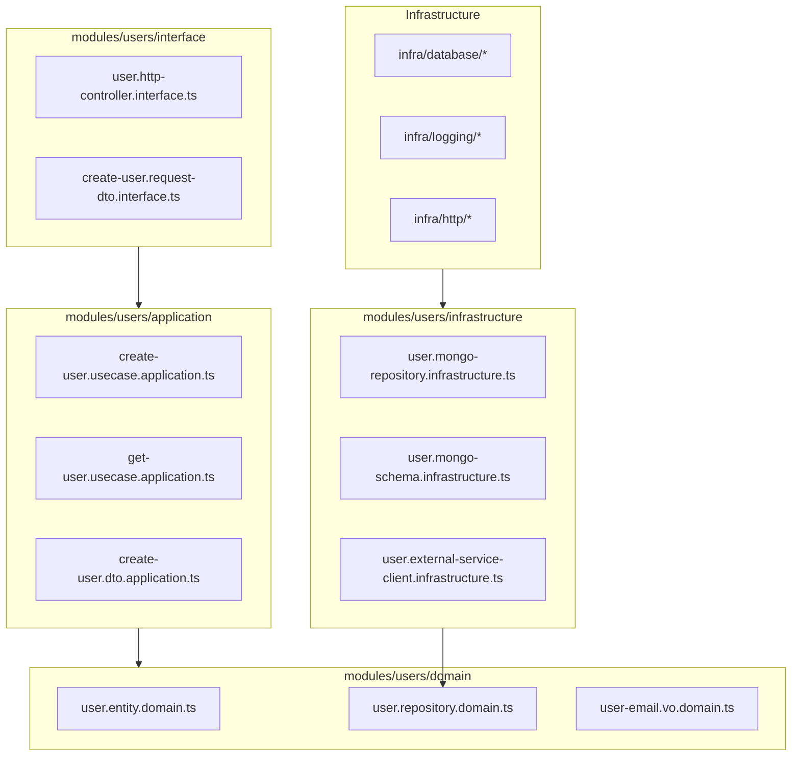
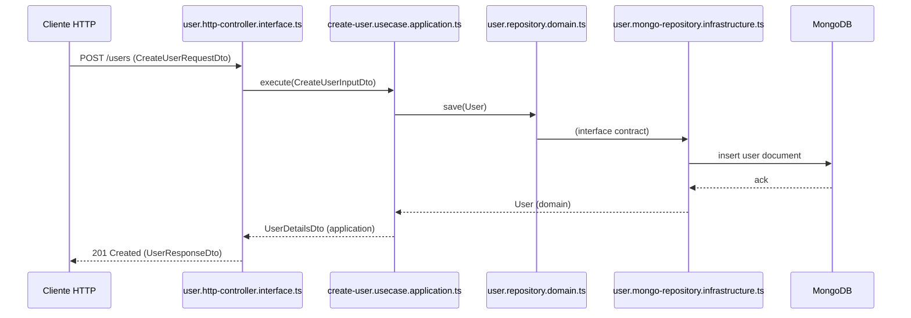

# Guía base de arquitectura hexagonal / cebolla para backends TypeScript

---

## 1. Objetivo de esta guía

Esta guía define una **estructura base de carpetas y archivos** para un proyecto backend (por ejemplo con NestJS, Express, Fastify, etc.) siguiendo una arquitectura **hexagonal / onion**.

Está pensada para:

* Ser **genérica y reutilizable** en distintos proyectos.
* Mantener una **nomenclatura coherente y extensible**, similar a como WordPress define plantillas (`page-{slug}.php`, `single-{post-type}.php`).
* Separar claramente:

  * **Dominio** (reglas de negocio).
  * **Aplicación** (casos de uso / orquestación).
  * **Infraestructura** (BD, HTTP clients, colas, etc.).
  * **Interfaz / UI** (HTTP, CLI, eventos, etc.).
* Ofrecer un **módulo shared/** para reutilizar componentes comunes.
* Escalar sin perder orden.

> El objetivo es que cualquier equipo pueda usar esta guía como plantilla para arrancar un backend limpio y escalable.

---

## 2. Principios de arquitectura (Hexagonal / Onion)

### 2.1. Capas

La arquitectura se organiza en capas concéntricas (tipo cebolla):

1. **Dominio (domain)**

   * El corazón del sistema.
   * Contiene **entidades**, **value objects**, **servicios de dominio** y **interfaces (puertos)** hacia el exterior (por ejemplo `UserRepository.domain.ts`, `PaymentProvider.domain.ts`).
   * No conoce frameworks, ni BD, ni HTTP.

2. **Aplicación (application)**

   * Orquesta casos de uso.
   * Usa **interfaces del dominio** (repositorios, gateways) pero no sabe cómo se implementan.
   * Contiene **use cases**, **DTOs de aplicación**, **servicios de aplicación**.

3. **Interfaz / UI (interface)**

   * Expone el sistema al exterior: **HTTP**, **CLI**, **mensajería**, etc.
   * Aquí viven **controladores**, **routers**, **DTOs HTTP**, **validaciones de entrada**.

4. **Infraestructura (infrastructure/infra)**

   * Implementa detalles técnicos:

     * Conexiones a base de datos.
     * Clientes HTTP a otros servicios.
     * Adapters para colas, almacenamiento, logging, correo, etc.
   * Contiene **implementaciones concretas** de los puertos definidos en dominio.

### 2.2. Reglas de dependencia

* Las capas **exteriores pueden depender de las interiores**, pero **nunca al revés**:

  * Infraestructura → Application → Domain.
  * Interfaz → Application → Domain.
* El **dominio no importa nada** de aplicación, infraestructura o interfaz.
* La **aplicación solo conoce el dominio** (y opcionalmente algunos tipos de shared), nunca infra directa.

---

## 3. Nomenclatura de archivos

Inspirándonos en WordPress (`page-{slug}.php`, `single-{post-type}.php`), definimos un esquema **predecible y extensible**:

### 3.1. Convención base

```txt
{feature}.{layer}.{type}.ts
```

Donde:

* **feature**: nombre del caso de uso o recurso (ej. `user`, `catalog-item`, `auth`, `order`).
* **layer**: capa donde vive el archivo (`domain`, `application`, `interface`, `infrastructure`).
* **type**: rol específico del archivo (`entity`, `repository`, `controller`, `usecase`, `dto`, `schema`, `mapper`, etc.).

### 3.2. Ejemplos de nombres

* `user.entity.domain.ts` → Entidad de dominio `User`.
* `user.repository.domain.ts` → Interface de repositorio `UserRepository`.
* `create-user.usecase.application.ts` → Caso de uso `CreateUserUseCase`.
* `user.http-controller.interface.ts` → Controlador HTTP.
* `create-user.request-dto.interface.ts` → DTO de entrada HTTP.
* `user.mongo-repository.infrastructure.ts` → Implementación Mongo del repositorio de usuario.
* `user.orm-entity.infrastructure.ts` → Entidad ORM para BD relacional.
* `catalog-item.external-gateway.domain.ts` → Puerto para conectarse a Amazon / MercadoLibre.
* `amazon-catalog.gateway-axios.infrastructure.ts` → Implementación concreta del gateway Amazon usando axios.

> Esta nomenclatura se puede adaptar fácilmente: solo necesitas cambiar `feature` y reutilizar `layer` y `type`.

---

## 4. Estructura general de carpetas

A continuación se presenta una estructura **base** de proyecto, pensada para frameworks como NestJS pero agnóstica al framework en lo conceptual.

```txt
project-root/
├── package.json
├── tsconfig.json
├── .env
├── src/
│   ├── main.ts                      # Bootstrap de la app
│   ├── app.module.ts                # Módulo raíz / composition root (Nest u otro)
│   │
│   ├── modules/                     # Módulos de dominio (bounded contexts)
│   │   ├── users/                   # Ejemplo: módulo "users"
│   │   │   ├── domain/
│   │   │   │   ├── entities/
│   │   │   │   │   └── user.entity.domain.ts
│   │   │   │   ├── value-objects/
│   │   │   │   │   └── user-email.vo.domain.ts
│   │   │   │   ├── repositories/
│   │   │   │   │   └── user.repository.domain.ts
│   │   │   │   └── services/
│   │   │   │       └── user.domain-service.domain.ts
│   │   │   │
│   │   │   ├── application/
│   │   │   │   ├── dto/
│   │   │   │   │   ├── create-user.dto.application.ts
│   │   │   │   │   └── user-details.dto.application.ts
│   │   │   │   ├── use-cases/
│   │   │   │   │   ├── create-user.usecase.application.ts
│   │   │   │   │   ├── get-user.usecase.application.ts
│   │   │   │   │   └── update-user.usecase.application.ts
│   │   │   │   └── services/
│   │   │   │       └── user.application-service.application.ts
│   │   │   │
│   │   │   ├── interface/
│   │   │   │   ├── http/
│   │   │   │   │   ├── user.http-controller.interface.ts
│   │   │   │   │   └── dto/
│   │   │   │   │       ├── create-user.request-dto.interface.ts
│   │   │   │   │       └── user.response-dto.interface.ts
│   │   │   │   └── cli/
│   │   │   │       └── user.cli-controller.interface.ts
│   │   │   │
│   │   │   └── infrastructure/
│   │   │       ├── persistence/
│   │   │       │   ├── user.mongo-schema.infrastructure.ts
│   │   │       │   └── user.mongo-repository.infrastructure.ts
│   │   │       ├── mappers/
│   │   │       │   └── user.mapper.infrastructure.ts
│   │   │       └── external/
│   │   │           └── user.external-service-client.infrastructure.ts
│   │   │
│   │   └── (otros módulos de negocio...)
│   │
│   ├── shared/                      # Módulos y utilidades reutilizables
│   │   ├── domain/
│   │   │   ├── base-entity.domain.ts
│   │   │   ├── base-aggregate-root.domain.ts
│   │   │   └── base-value-object.domain.ts
│   │   ├── application/
│   │   │   └── usecase.base.application.ts
│   │   ├── interface/
│   │   │   ├── http/
│   │   │   │   ├── base-http-controller.interface.ts
│   │   │   │   └── http-exception.filter.interface.ts
│   │   │   └── filters/
│   │   └── utils/
│   │       ├── date.utils.ts
│   │       ├── string.utils.ts
│   │       └── pagination.utils.ts
│   │   ├── validators/
│   │   │   └── email.validator.ts
│   │   ├── exceptions/
│   │   │   └── domain-exception.ts
│   │   └── constants/
│   │       └── app.constants.ts
│   │
│   └── infra/                       # Infraestructura transversal
│       ├── database/
│       │   ├── database.module.ts
│       │   └── mongoose.config.ts
│       ├── logging/
│       │   ├── logging.module.ts
│       │   └── logger.infrastructure.ts
│       ├── mail/
│       │   └── mailer.infrastructure.ts
│       ├── storage/
│       │   └── storage.infrastructure.ts
│       ├── http/
│       │   └── axios-http-client.infrastructure.ts
│       └── config/
│           └── config.module.ts
│
└── test/ (opcional)
```

> Esta estructura es un **ejemplo base**. Puedes agregar o quitar capas por módulo según necesidad, pero la idea principal es mantener la separación **domain → application → interface / infrastructure**.

---

## 5. Explicación de cada carpeta y archivo

### 5.1. `src/main.ts`

* Punto de entrada de la aplicación.
* Inicializa el servidor HTTP/CLI/eventos según el framework.
* Configura middlewares globales, pipes, filtros, etc.
* No contiene lógica de negocio.

Ejemplo típico (pseudocódigo):

```ts
// main.ts (ejemplo genérico)
async function bootstrap() {
  const app = await createApp(AppModule);
  await app.listen(process.env.PORT ?? 3000);
}

bootstrap();
```

---

### 5.2. `src/app.module.ts`

* **Composition root** del sistema.
* Orquesta módulos de dominio y módulos de infraestructura.
* No debe contener lógica de negocio, solo wiring:

  * Importar `DatabaseModule`, `ConfigModule`, `LoggingModule`, etc.
  * Importar `UsersModule`, `OrdersModule`, etc.

---

### 5.3. `src/modules/`

Contiene los **bounded contexts** o módulos de negocio.

Cada módulo (por ejemplo `users`) sigue la misma estructura interna:

```txt
modules/
  users/
    domain/
    application/
    interface/
    infrastructure/
```

#### 5.3.1. `domain/`

**Responsabilidad:** modelo de negocio puro.

Subcarpetas típicas:

* `entities/`

  * `user.entity.domain.ts`
  * Define el estado y comportamiento principal del agregado `User`.

* `value-objects/`

  * `user-email.vo.domain.ts`
  * Tipos inmutables con reglas (ej: `Email`, `Money`, `PhoneNumber`).

* `repositories/`

  * `user.repository.domain.ts`
  * Interfaces (puertos) que definen cómo el dominio espera acceder a la persistencia (`save`, `findById`, etc.).

* `services/`

  * `user.domain-service.domain.ts`
  * Lógica de negocio que no encaja naturalmente en una sola entidad (reglas entre agregados, políticas).

> El dominio **no importa** nada de infraestructura, interface o framework.

#### 5.3.2. `application/`

**Responsabilidad:** orquestar casos de uso.

Subcarpetas:

* `dto/`

  * `create-user.dto.application.ts`
  * DTOs usados **dentro de la capa de aplicación**, no son necesariamente los mismos que se exponen por HTTP.

* `use-cases/`

  * `create-user.usecase.application.ts`
  * `get-user.usecase.application.ts`
  * Cada archivo representa un caso de uso del sistema.

* `services/` (opcional)

  * `user.application-service.application.ts`
  * Servicios que coordinan varios casos de uso o integraciones de alto nivel.

> La capa de aplicación depende del **dominio** y de las **interfaces de repositorios / gateways** definidas en el dominio, nunca de la infraestructura concreta.

#### 5.3.3. `interface/`

**Responsabilidad:** manejar la entrada/salida con el mundo exterior.

Subcarpetas:

* `http/`

  * `user.http-controller.interface.ts`
  * Controladores/routers HTTP.
  * `dto/` internos para requests/responses HTTP:

    * `create-user.request-dto.interface.ts`
    * `user.response-dto.interface.ts`

* `cli/` (si aplica)

  * `user.cli-controller.interface.ts` para comandos de consola.

> Aquí mapeas **HTTP/CLI → DTOs de aplicación → casos de uso**.

#### 5.3.4. `infrastructure/`

**Responsabilidad:** detalles técnicos específicos del módulo.

Subcarpetas típicas:

* `persistence/`

  * `user.mongo-schema.infrastructure.ts`
  * `user.mongo-repository.infrastructure.ts`
  * Implementaciones de `UserRepository` usando Mongo, Postgres, etc.

* `mappers/`

  * `user.mapper.infrastructure.ts`
  * Mapeos entre dominio ↔ persistencia ↔ DTOs externos.

* `external/`

  * `user.external-service-client.infrastructure.ts`
  * Clientes HTTP a otros servicios, colas, etc. específicos de este módulo.

> Estos adapters implementan las **interfaces del dominio** (repositorios, gateways) y dependen de BD, clientes HTTP, etc.

---

### 5.4. `src/shared/`

Módulo compartido para componentes reutilizables.

#### 5.4.1. `shared/domain/`

* `base-entity.domain.ts`

  * Clase base para entidades (id, equals, etc.).

* `base-aggregate-root.domain.ts`

  * Base para agregados (manejo de eventos de dominio).

* `base-value-object.domain.ts`

  * Base para value objects (comparación estructural, validaciones).

**Uso típico:**

```ts
// user.entity.domain.ts
export class User extends BaseAggregateRoot<UserId> {
  // ...
}
```

#### 5.4.2. `shared/application/`

* `usecase.base.application.ts`

  * Interface/base para casos de uso (ej: `execute(input): Promise<output>`).

#### 5.4.3. `shared/interface/`

* `http/base-http-controller.interface.ts`

  * Clase base para controladores HTTP (manejo de respuestas estándar).

* `http-exception.filter.interface.ts`

  * Filtros / interceptores comunes para excepciones HTTP.

#### 5.4.4. `shared/utils/`

Funciones utilitarias puras:

* `date.utils.ts` → funciones comunes para fechas.
* `string.utils.ts` → normalizado de strings, slugs, etc.
* `pagination.utils.ts` → helpers para paginación.

#### 5.4.5. `shared/validators/`

Validadores reutilizables:

* `email.validator.ts`
* `phone.validator.ts`

Pueden usarse en dominio, application o interface.

#### 5.4.6. `shared/exceptions/`

Excepciones comunes:

* `domain-exception.ts` → base para errores de dominio.
* `application-exception.ts` → errores de orquestación.
* `infrastructure-exception.ts` → errores técnicos.

#### 5.4.7. `shared/constants/`

Constantes compartidas:

* `app.constants.ts`

  * Ej: nombres de eventos, tokens de DI, valores por defecto.

---

### 5.5. `src/infra/` (Infraestructura transversal)

Aquí se ubican componentes **transversales** que no pertenecen a un solo módulo, sino a toda la app.

#### 5.5.1. `infra/database/`

* `database.module.ts`

  * Orquesta conexiones a BD: Mongo, Postgres, etc.
  * Se encarga de leer variables de entorno (`DB_TYPE`, `MONGO_URI`, etc.) y configurar el motor correspondiente.

* `mongoose.config.ts` (u otro nombre específico)

  * Config específica para Mongoose.

> Este módulo se importa en `AppModule`, no en los módulos de negocio.

#### 5.5.2. `infra/logging/`

* `logging.module.ts`

  * Configura el logger global (winston, pino, etc.).

* `logger.infrastructure.ts`

  * Clase/servicio que encapsula el logger concreto.

#### 5.5.3. `infra/mail/`

* `mailer.infrastructure.ts`

  * Cliente de correo (SendGrid, SES, SMTP) envuelto en un servicio.

#### 5.5.4. `infra/storage/`

* `storage.infrastructure.ts`

  * Cliente de almacenamiento (S3, GCS, Azure Blob, etc.).

#### 5.5.5. `infra/http/`

* `axios-http-client.infrastructure.ts`

  * Cliente HTTP genérico.
  * Puede ser usado por otros módulos de infraestructura para hablar con servicios externos.

#### 5.5.6. `infra/config/`

* `config.module.ts`

  * Centraliza la carga de configuración (variables de entorno, archivos de config, etc.).

---

## 6. Cómo se conectan las capas

### 6.1. Flujo lógico: de fuera hacia adentro

Ejemplo: `POST /users` (crear usuario)

1. **Capa Interface (HTTP)**

   * `user.http-controller.interface.ts` recibe la petición HTTP.
   * Mapea el body a `CreateUserRequestDto` (HTTP DTO).
   * Valida campos básicos (class-validator, etc.).

2. **Capa Application**

   * El controlador construye un `CreateUserInputDto` (application DTO) y llama a `CreateUserUseCase.execute(dto)`.
   * El caso de uso:

     * Usa `UserRepository` (interface de dominio) para comprobar si el usuario ya existe.
     * Crea una entidad `User` usando lógica de dominio.
     * Llama a `userRepository.save(user)`.

3. **Capa Domain**

   * `User` (entidad) aplica reglas de negocio (validaciones internas, invariantes).
   * `UserRepository` es solo una interface aquí.

4. **Capa Infrastructure**

   * `UserMongoRepository.infrastructure.ts` implementa `UserRepository`.
   * Mapea `User` ↔ `UserMongoDocument` usando un mapper.
   * Usa Mongoose/ORM para persistir en la BD.

5. **Respuesta**

   * `CreateUserUseCase` devuelve un DTO de aplicación (`UserDetailsDto`).
   * El controlador HTTP lo mapea a `UserResponseDto` (HTTP) y construye la respuesta JSON.

### 6.2. Reglas de dependencia (resumen)

* `domain/*` **no depende** de nada externo.
* `application/*` depende de `domain/*` y de `shared/*`.
* `interface/*` depende de `application/*`, `domain/*`, `shared/*`.
* `infrastructure/*` depende de `domain/*`, `shared/*` y de librerías externas (BD, HTTP, etc.).
* `infra/*` (transversal) se importa desde `app.module.ts` y luego es usado por `infrastructure/*` de cada módulo.

---

## 7. Organización del módulo `shared/`

### 7.1. Objetivo de `shared/`

* Evitar duplicar lógica transversal.
* Ofrecer **bases comunes** para entidades, use cases, validadores, excepciones, etc.
* Mantener el dominio de cada módulo limpio y enfocado en su contexto específico.

### 7.2. Subcarpetas sugeridas

| Carpeta               | Contenido                                        |
| --------------------- | ------------------------------------------------ |
| `shared/domain/`      | Clases base para entidades, agregados, VOs       |
| `shared/application/` | Clases base / interfaces para use cases          |
| `shared/interface/`   | Bases para controladores, filtros, interceptores |
| `shared/utils/`       | Funciones puras reutilizables                    |
| `shared/validators/`  | Validadores reutilizables                        |
| `shared/exceptions/`  | Excepciones comunes                              |
| `shared/constants/`   | Constantes globales y tokens de DI               |

> La regla: si algo es utilizado por **más de un módulo**, probablemente debería moverse a `shared/`.

---

## 8. Organización de `infra/` (infraestructura transversal)

### 8.1. Objetivo de `infra/`

* Centralizar elementos técnicos **que no pertenecen a un solo módulo de dominio**, por ejemplo:

  * Conexión global a la base de datos.
  * Logging.
  * Configuración.
  * Clientes HTTP genéricos.

### 8.2. Ejemplo de responsabilidades

* `infra/database/`

  * Exponer un `DatabaseModule` que configure `MongooseModule` o `TypeOrmModule` según `DB_TYPE`.

* `infra/logging/`

  * Proveer un `LoggingModule` que configure logs estructurados globales.

* `infra/config/`

  * Utilizar `ConfigModule` o similar para manejar `.env` y perfiles.

> Los módulos de dominio no deberían conocer los detalles de cómo se conecta la base de datos: solo deberían recibir repositorios/gateways ya resueltos por la composición de módulos.

---

## 9. Buenas prácticas para escalar esta arquitectura

1. **Un módulo por contexto de negocio (bounded context)**

   * No mezclar conceptos de dominios muy distintos en el mismo módulo.

2. **Clara separación de responsabilidades**

   * No meter lógica de negocio en controladores.
   * No meter lógica de infraestructura en casos de uso.

3. **Uso disciplinado de interfaces (puertos)**

   * Toda dependencia hacia el exterior (BD, API externa, cola, etc.) debe pasar por una interface definida en **dominio**.

4. **Mappers dedicados**

   * No mezclar mapeo de modelos (BD ↔ dominio ↔ DTOs) dentro de entidades o controladores.
   * Cada cambio de "lenguaje" (dominio → persistencia → transporte) debería tener un mapper claro.

5. **DOMINIO sin dependencias de framework**

   * No importes Nest, Express o Mongoose en `domain/`.
   * Esto permite:

     * Reutilizar dominio en otro proyecto o proceso (ej. worker).
     * Testear dominio sin levantar el framework.

6. **Aplicación como orquestador, no como dumping ground**

   * Cada caso de uso debe ser pequeño y enfocado.
   * Revisa periódicamente que la lógica no se esté haciendo demasiado compleja.

7. **Infraestructura reemplazable**

   * Usa variables de entorno y módulos de DI para seleccionar implementaciones (ej. `DB_TYPE=mongo|postgres`).
   * Evita hardcodear tecnología dentro de casos de uso o entidades.

8. **Convenciones estrictas de nombres**

   * Respeta el patrón `{feature}.{layer}.{type}.ts`.
   * Esto facilita navegar el proyecto e incorporar desarrolladores nuevos.

9. **Documentar contratos**

   * Interfaces de repositorios y gateways deben estar bien documentadas.
   * Así infra sabe qué debe implementar y QA sabe qué probar.

10. **Modularizar por dominio, no por tipo técnico**

    * Evita tener carpetas gigantes tipo `services/`, `controllers/` en `src/` raíz.
    * Siempre agrupa por módulo de negocio (`users/`, `orders/`, `catalog/`).

---

## 10. Diagrama de arquitectura tipo cebolla (mermaid)

### 10.1. Diagrama de capas



### 10.2. Diagrama de flujo de una petición



---

## 11. Cómo adaptar esta estructura a nuevos proyectos

1. **Duplicar estructura base**

   * Copia `src/modules`, `src/shared`, `src/infra`, `src/app.module.ts`, `src/main.ts` como plantilla.

2. **Definir módulos de dominio**

   * Crea carpetas en `modules/` según tu dominio: `orders/`, `billing/`, `inventory/`, etc.

3. **Crear contratos de dominio primero**

   * Define entidades `*.entity.domain.ts`.
   * Define repositorios `*.repository.domain.ts`.
   * Define VOs `*.vo.domain.ts` si los necesitas.

4. **Agregar casos de uso**

   * En `application/use-cases/`, crea archivos `*.usecase.application.ts` para cada acción de negocio.

5. **Exponer interfaces (HTTP, CLI, eventos)**

   * En `interface/http/`, crea controladores y DTOs.
   * Conecta controladores con casos de uso.

6. **Implementar infraestructura poco a poco**

   * En `infrastructure/persistence/`, implementa repositorios para la BD que elijas.
   * Usa `infra/database/` para manejar la conexión global.

7. **Reutilizar `shared/`**

   * Extrae a `shared/` cualquier pieza que empieces a copiar entre módulos.

8. **Revisar las dependencias periódicamente**

   * Asegúrate de que `domain/` siga siendo independiente.
   * Verifica que `application/` no empiece a llamar directamente a librerías de infraestructura.

---

Con esta guía tienes una **plantilla completa**, tanto a nivel de **estructura de carpetas** como de **conceptos**, para implementar una arquitectura hexagonal / cebolla en proyectos backend TypeScript.

Puedes extenderla, recortar partes o especializarla por framework (NestJS, Express, Fastify), pero la idea central se mantiene: **mantener el dominio en el centro y todo lo demás girando a su alrededor.**
